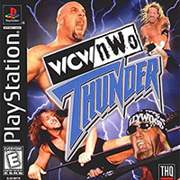

# WCW/nWo Thunder

A decompilation of the _WCW/nWo Thunder_ video game on PlayStation.

## Building
The project has a `Makefile` that builds an executable from assembly. This expects the main executable from the game disc (**SLUS_007.79**) in the **disc** sub-directory. This file is not provided, so you are expected to have your own copy.

With the executable in the correct location, you should be able to run `make setup`. If that step succeeds, then run `make`. The `Makefile` will, by default, report if the generated executable matches the original.

> [!TIP]
> If you are on a non-Linux environment (including macOS), there is a [**Dockerfile**](Dockerfile) that will install the required packages, and can be used to run `make` commands instead.

## Contributing
Contributions are most welcome. Please see [CONTRIBUTING.md](.github/CONTRIBUTING.md)
